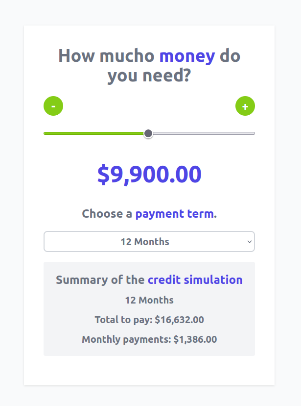

# creditQuoterReact

This is a basic app to make a simulation of a financial credit, we can select from a range input an amount between 0 and 20.000 and a payment period between 6 and 24 months, then we can see how automatically the app update the simulation with its total payment amount and the monthly payment amount

This project was made using vite with react and javascript, for styles is used tailwindcss.

Finally you can chech a live demo deploy on netlify: https://effervescent-youtiao-84a1d1.netlify.app/

